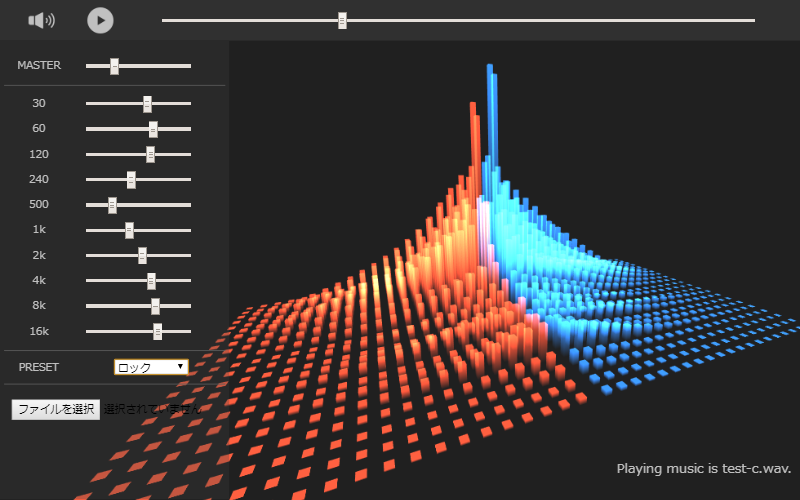

# WebAudioで高速フーリエ変換

## 概要

ScriptProcessorNodeと高速フーリエ変換(FFT)を使用してパラメトリック・イコライザを実装しています。

さらに変換途中の周波数成分情報をWebGLに流し込んでオーディオ・ビジュアライザも実装しています。

## 依存

面倒なことをせずとも簡単に実行できるように他のライブラリに依存しないように作成してあります。

## 実行方法

適当なApacheやnginx等のミドルウェアでサーバを立ててsrcディレクトリにブラウザでアクセスするか、
srcディレクトリに入っているindex.htmlをブラウザで開くだけです。

## 使用方法

- 再生/停止  
上部にある左から2番目のボタンを押すと音声データの再生と停止を行うことができます。  
あとプログラムを開始した直前は音声がならないので再生ボタンを押してください。

- イコライザの表示/非表示
上部にある1番左のボタンを押すとイコライザの表示/非表示を切り替えることができます。

- ビジュアライザの回転  
ビジュアライザをドラッグすることにより任意の方向に回転することができます。

- 音声データの指定  
イコライザの下にある音声ファイル指定のボタンを押すか音声ファイルをビジュアライザの上にドラッグ・アンド・ドロップ
してください。

## 音声データについて

このサンプルプログラムで使用している音楽データはMusMus様よりお借りしています。 
 
http://musmus.main.jp/

## プログラムのライセンス

MITライセンスです。ご自由にお使いください。
